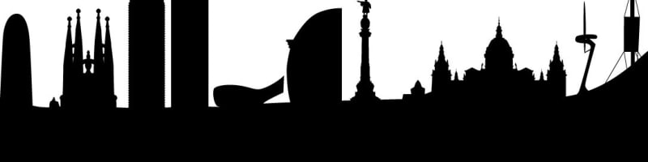

# Práctica HTML-CSS - Full Stack Web Developement
Xavi Roca Vilalta (NOV.22)

## Estructura de archivos
* index.html
* carperta `css`
    - reset.css (para limpiar los defectos de los navegadores)
    - style.css (estilos generales)
    - carousel.css (para el carrusel de proyectos)
    - skills.css (para las barras de progreso)
    - transition.css (efecto HOVER en las opciones de las navbar)
* carpeta `images`

## Recursos utilizados para cada uno de los puntos

### Control de visualización correcta en Chrome, Firefox, Edge
* Verificación disponibilidad en <https://caniuse.com>

### Links con estado hover suavizado con una transición 
* Código en `transition.css` :
~~~
.menu-item a {
    background-color: var(--main-background-color);
    transition: background-color .5s;
  }

@media screen and (min-width: 768px) {
    .menu-item a:hover {
        cursor: pointer;
        background-color: lightblue;
    }  
}
~~~

### Header con imagen de fondo optimizada a distintas resoluciones, e imagen distinta para distintos tamaños.
* Utilizo `https://responsivebreakpoints.com/` para generar 4 resoluciones de la misma imagen
* La herramienta me genera el código html necesario
* Genero 2 juegos de imagenes distintos: para tamaños grande de pantalla y para tamaños pequeños
* Código:
~~~
    <header class="header-image">
        <picture>
            <source
            media="(min-width: 620px)"
            srcset="
                images/barcelona_in0jkm_c_scale,w_200.jpg 200w,
                images/barcelona_in0jkm_c_scale,w_624.jpg 624w,
                images/barcelona_in0jkm_c_scale,w_1042.jpg 1042w,
                images/barcelona_in0jkm_c_scale,w_1200.jpg 1200w"
            >       
            <source
            media="(max-width: 620px)"
            srcset="
                images/BCN_Landscape_ahfp4s_c_scale,w_180.jpg 180w,
                images/BCN_Landscape_ahfp4s_c_scale,w_608.jpg 608w,
                images/BCN_Landscape_ahfp4s_c_scale,w_800.jpg 800w"
            > 
                 
        </picture>
    </header>
~~~
   
### Carrusel con nuestros trabajos
* He utilizado el ejemplo de carrusel que trabajamos en la clase
* He insertado algun video de Youtube mediante iframe, con el código embebido que propone Youtube directamente, eliminando las dimensiones fijas

### Skills con progreso
* He utilizado la orientación que nos diste en el discord: dos DIVs anidados, el de fuera con el borde y el de dentro sólido con un `width`igual al porcentaje del skill

### Validación html de cada input
* Código:
~~~
<input type="text" name="Github tag" id="githug-tag" placeholder="Github tag" pattern="^@[^\s]+">
~~~

### Links a redes sociales sin dejar rastro en ellas
* Código: atributo -->  `rel="noreferrer noopener"`
~~~
            

                
            

~~~

### Página con nuestros trabajos usando css grid
* He programado un botón debajo del carrusel para que aparezca el grid de detalles deproyectos desplazandose desde la derecha. El GRID está maquetado a 3 resolcuiones diferentes, mobile first of course.

### Etiquetas de contenido semántico
* Etiquetas utilizadas: HEADER, NAV, SECTION, FOOTER

### Mobile first
* Las Media Queries se utilizan para maquetar con más ancho de pantalla, tipo desktop

### Animaciones o interactividad únicamente con css
* He utilizado `animation` y `transition`, sin javascript

## Opcionales

### Menu burger basado en CSS
* Ref --> https://alvarotrigo.com/blog/hamburger-menu-css-responsive/
* No me ha dado tiempo a implementarlo

### Despliegue en Github pages
* Desplegado en Github pages --> https://habana2000.github.io/PracticaHTMLCSS/

### Página 404
* Creada la página 404

### Página 500
* Creada la página 500

## Github y desarrollo del proyecto
* Se inicia la construcción del portfolio trabajando contra este repositorio Github.
* El repositorio contiene todos los commits del proyecto
* La práctica se ha trabajado desde distintos equipos, cada uno con su repositorio local y configuración GIT.

# Resultado práctica: APTO

~~~
---------- Mensaje original ----------
De: Kevin Martinez <kevinccbsg@gmail.com>
Para: xroca@vilamatica.com
Cc: Oscar Javier Paredes <administracion@keepcoding.io>
Fecha: 30/12/2022 21:56 CET
Asunto: Práctica HTML y CSS

Hola Javier,

El resultado de la práctica es APTO. Me costo un poco poner el APTO en este caso ya que en la resolución mobile se rompe, la web generando un scroll horizontal. Esto es debido al textarea, que tienes puesto las cols en el html. Sería mejor haberle puesto un 100% a ese elemento.

Otras dos cosas que se ven mal es el carousel. Esto es porque usas overflow scroll y debería ser hidden para simular el efecto de carousel.

Por último, en la parte de mostrar proyectos al abrirlo (eso mola bastante) se queda cortado. Eso es porque usas 100vh tendrías que haber usado un porcentaje.

Al final resolviste lo de la animación de la progress bar, Genial!.

Intenta mejorar esos pequeños detalles, pero quitando esos aspectos visuales todo lo requerido y extra está correcto por eso el APTO.

Un saludo.
~~~

